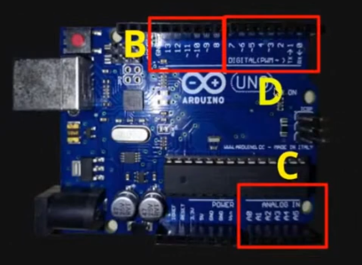

# Rust-en-Arduino
## Investigación sobre como programar dispositivos bare metal utilizando el lenguaje de programación rust, tanto sin capa de abstracción, como con ella.

### **Este documento recoge información de como programar un dispositivo arduino con Rust, no es una guía paso a paso de como hacerlo, así que hay inconsistencia semántica, ya que son apuntes sobre el tema.** 

Como se programaria en rust se tendria que determinar que no se use la libreria estandar(ya que no tiene sistema operativo) y que tampoco determine un punto de entrada, esto se haria de la siguiente manera:
```rust
#![no_main]
#![no_std]
#[no_mangle]
```
no mangle determina a rust que el nombre de la funcion no se codifique y se quede con el string sin hacerle el hash, esto lo necesitamos porque el bootloader de arduino busca los nombres de las funciones sin hash, si dejamos el valor de fabrica nunca encontrara las funciones

y también es necesario poner: "extern C" ya que la función main se llamara desde el ABI de C del bootloader de arduino. Es necesario añadir también un código para hacer un handler de panic, para cuando haya un error a la hora de ejecutar el código. Esto se haría de la siguiente manera:
```rust
#[no_mangle]  
pub extern "C" fn main(){}  
  
#[panic_handler]  
fn panic(_info: &::core::panic::PanicInfo) -> !{ 
    loop {}  
}
```
Lo que hay dentro de la función panic se puede cambiar dependiendo de lo que se quiera hacer cuando haya un crasheo en el codigo.
El "!" en el parámetro de salida de la función panic sirve para determinar que la función es infinita y no es posible salir de ella.

Sobre el archivo: cargo.toml sera necesario añadirle un par de lineas para la compilación


```toml
[profile.release]
lto=true
panic="abort"
```

Esto se hace para mitigar un bug que hay en llvm con la linea de: "lto=true", y para que cuando haya un fallo en el programa el stack no se llegue a borrar completamente y se pone un "eh_personality" genérico(eh=exception handler).

A la hora de compilar sera necesario los parametros "-Z build-std=core", "--target avr-atmega328p.json" y "--release"(debe hacerse con la version nightly "nocturna")

Sobre el archivo "atmega328p.json", es un archivo json que incluye información de la arquitectura destino(arquitectura de "arduino")


Los registros son los siguientes:

](https://github.com/FabLab-Merida/Rust-en-Arduino/blob/main/images/Pasted%20image%2020240124182626.png?raw=true)

y se utilizan de la siguiente manera:

![[[images/Pasted image 20240124182706.png]]](https://github.com/FabLab-Merida/Rust-en-Arduino/blob/main/images/Pasted%20image%2020240124182706.png)

Se puede elegir toda una sección de registros si no se pone el número a la hora de determinarlo.
Se puede conocer que pines son que registro de la siguiente manera:

![[[images/Pasted image 20240124183134.png]]](https://github.com/FabLab-Merida/Rust-en-Arduino/blob/main/images/Pasted%20image%2020240124183134.png)

Nos iríamos a al hoja de especificación del microcontrolador(atmega).


La forma de acceder a estos pines sería de la siguiente manera:
```rust
use core::ptr::{read_volatile, write_volatile};
const DDRB: *mut u8=0x24 as *mut u8;
const PORTB: *mut u8=0x25 as *mut u8;

#[no_mangle]
pub extern "C" fn main(){
	unsafe {write_volatile(DDRB,0b11111111)};
	unsafe {write_volatile(PORTB,0b00100000)};
}
```
Esto hace que todos los pines estén marcados como salida, y que estamos escribiendo en un solo pin.

![[[images/Pasted image 20240124184221.png]]](https://github.com/FabLab-Merida/Rust-en-Arduino/blob/main/images/Pasted%20image%2020240124184221.png)

Una vez compilado sera necesario exportarlo al arduino, esto se puede hacer mirando en el arduino IDE(como administrador) para mirar que puerto nos ha asignado el sistema operativo para el arduino que este conectado.

![[[images/Pasted image 20240124185329.png]]](https://github.com/FabLab-Merida/Rust-en-Arduino/blob/main/images/Pasted%20image%2020240124185329.png)

y convertir el .elf(resultado de compilación) a un .hex, esto se hace de la siguiente manera:
```bash
avr-objcopy -0 ihex -R .eeprom path/to/file.elf <output>.hex
```

para enviar el .hex a un arduino sería a traves del comando:
 
```shell
avrdude -p atmega328p -c arduino -P <puerto> -U flash:w:<archivo.hex>:i
```

Donde el puerto es el que sacamos anteriormente del "arduino IDE"

Para crear un loop en el main del programa se utiliza la estructura loop de rust, la forma mas sencilla de hacer un bucle en rust
```rust
loop{
	//codigo a repetir
}
```
este código se repetirá hasta que haya un: "break" o el programa finalice

El atmega funciona a 16 MHz asi que será necesario poner una forma de incluir retardo o se repetira la función 16000000 veces por segundo

pero no podemos utilizar la función sleep predeterminada de rust, porque viene incluida en la librería estadar (std)

Se tendría que hacer mediante la operación en ensamblador "nop", que es una función que no hace nada durante un ciclo del procesador, por lo que se podría hacer la función sleep a mano, de la siguiente manera:

```rust
#[feature(asm_experimental_arch)]
use core::arch::asm;

const vel_CPU:u32=16000000; // se puede poner _ para separación por miles, millones, etc

fn sleep(tiempo:u32){
	for _ in 0..(vel_CPU / 10 * tiempo){
		unsafe{asm!("nop")}
	}
}

```
El for en rust funciona por iteradores así que consume tiempo en ciclos de CPU, por eso se divide entre 10(investigar si hay una manera de hacer que sea mas eficiente).

En rust "const" hace la misma declaración que una variable inmutable (comando let)

Se utiliza la librería "asm", que contiene operaciones de ensamblador por estructura(core::arch::asm).

Para incluir la libreria es necesario habilitar la macro de "#![feature(asm_experimental_arch)]"

para que no haga falta colocar todo el rato los números de los puertos necesarios en binario los podemos leer directamente de los puertos

utilizando la opción de read_volatile que habiamos incluido anteriormente


```rust
#[no_mangle]
loop{
	let mut val_portb=unsafe{read_volatile(PORTB)};
	val_portb=val_portb ^ (1 << 5);
	unsafe{ write_volatile(PORTB, val_portb)};
	sleep(1);
}
```


el operador "^" es el operador lógico XOR, que es el que hace que si las dos entradas son distintas la salida es 1 y si las dos entradas tienen valores iguales entonces devuelve 0. Sigue la siguiente tabla:

| A   | B   | S   |
| --- | --- | --- |
| 0   | 0   | 0   |
| 0   | 1   | 1   |
| 1   | 0   | 1   |
| 1    | 1    | 0    |

El otro operador "<<" es el operador de "shift left", que lo que hace es que mueve el valor en binario hacia la izquierda, es decir:

| A   | B   | S     |
| --- | --- | ----- |
| 0b1 | 2   | 0b100 |
| 0b101    | 5    | 0b10100000      |


A la hora de hacer que un led se encienda estas operaciones son complejas de por si, pero si tuviesemos que realizar una serie de operaciones mas complejas por que nuestro proyecto lo requiere como leer por puertos analógicos o utilizar una pantalla led de ciertos segmentos y etc la operación puede complicarse mucho, asi que ahora vamos a introducir a los apartados una capa de abstracción de software(HAL).

En rust existe un crate(Paquete descargable), llamado embedded-hal, que nos puede ayudar con estos problemas, este crate tiene una serie de instrucciones que ayudarán a la hora de desarrollar un sistema embedded.

La ventaja es que las capas de abstracción permiten que las implementaciones se hagan por sistema, que tengas una función en la que tu le des unos valores de entrada y la función lo haga automáticamente sin que tengas que escribir todo el rato las especificaciónes del circuito para funcionar.


```rust
trait OutputPin{
	fn set_high();
	fn set_low();
	fn toggle();
	...
}
trait InputPin{
	fn is_low() -> bool;
	fn is_high() -> bool;
}
// Esto seria para todas las funciones deseadas y luego seria implementarlas
```

Para fines ilustrativos pondré un par de ejemplos(el código no es específicamente funcional):

```rust
fn Blink(pin: &mut OutputPin, delay: &mut DelayUs) -> !{
	pin.set_high();
	loop{
		pin.toggle();
		delay.delay_ms(1000);
	}
}
```

En principio cada placa tiene su propia implementación de las HAL, entonces podria escribir una capa de abstracción de arduino para poder hacer que el trabajo a largo plazo sea mas sencillo y no tenga que utilizar y escribir uno todo el rato ni escribir funciones en ensamblador y binario continuamente, a continuación pondre el ejemplo de como se usaria una HAL de arduino diseñada con anterioridad(no implementado):
```rust
struct Pin{
	ddr: *mut u8;
	port: *mut u8;
	number: u8;
}
impl embedded_hal::Output_Pin for Pin{
	fn set_high(&self){
		let mut val_pin=unsafe{read_volatile(self.port)};
		val_pin=val_pin | (1<<self.number);
		unsafe{write_volatile(self.port,pin_value)};
	}
	fn set_low(&self){...}
	fn set_toggle(&self){...}
}
```

En este caso no es necesario utilizar una operación XOR ya que simplemente es activar el pin no hacerle un toggle(Se lee el puerto con anterioridad a traves del read_volatile).

No todos los HAL permiten punto de entrada de sistema embedded pero si lo contienen(si esta implementado) entonces se puede acceder utilizando el macro:

```rust
#[arduino_hal::entry]
```

Si tienes diseñado el hal de arduino a partir de la libreria embedded_hal luego puedes utilizarlo para cualquier placa similar y solucionar múltiples problemas y agilizar el trabajo a la larga.
Un ejemplo de este código sería(código no funcional):

```rust
#[arduino_hal::entry] // especificas el punto de entrada
fn main() -> !{
	let mut led_pin = arduino_hal::pins::B5;
	led_pin.set_output();
	blink::blink(led_pin);
}
```

Lo que conseguimos con estas capas de abstracción es que escribir para estas placas sea práctico y mas sencillo de utilizar

utilizando una HAL un codigo que antes era:

```rust
#![no_main]  
#![no_std]  
use core::arch::asm;  
use core::ptr::{read_volatile,write_volatile};  
const DDRB: *mut u8 =0x24 as *mut u8;  
const PORTB: *mut u8 =0x25 as *mut u8;  
  
#[no_mangle]  
pub extern "C" fn main(){  
    unsafe {write_volatile(DDRB,0b11111111)}; // todos los pines a salida  
    unsafe {write_volatile(PORTB,0b00100000)};// poner voltaje alto en el pin 5  
    loop {  
  
    }  
}  
  
#[feature(asm_experimental_arch)]  
const vel_CPU:u32=16000000; // se puede poner _ para separación por miles, millones, etc  
fn sleep(tiempo:u32){  
    for _ in 0..(vel_CPU / 10 * tiempo){  
        unsafe{asm!("nop")}  
    }  
}  
  
  
#[panic_handler]  
fn panic(_info: &::core::panic::PanicInfo) -> !{  
    loop {}  
}
```
(Sin utilizar la implementación secundaria de identificación de puertos usando read_volatile)
pasa a ser:
```rust
use panic_halt as _;

#[arduino_hal::entry]
fn main() -> ! {
	let peripherals = arduino_hal::Peripherals::take().unwrap();
	let pins = arduino_hal::pins!(peripherals);
	let mut led = pins.d13.intro_output();
	led.set_high();

	loop{
		led.toggle();
		delay_ms(1000);
	}
}
```

Ya existen diferentes implementaciones creadas por la comunidad para "panic" y, en principio, para "HALs".
Gracias a esto tampoco es específicamente necesario lidiar con bootloaders una vez que ya tienes el HAL de cada placa

En el .toml habría que incluir la librería arduino-hal(si es que la queremos utilizar, sirve tanto implementada como descargada anteriormente) y la librería panic-halt.
![[[Pasted image 20240128003856.png]]](https://github.com/FabLab-Merida/Rust-en-Arduino/blob/main/images/Pasted%20image%2020240128003856.png)

Se pueden utilizar tanto la versión por control de bajo nivel(con registros manuales) o la versión de alto nivel(con el HAL).

Arduino con los pines analógicos pone un valor entre 0 y 1023 para determinar que valor asignar de entrada y de salida

Buscar información de como leer los datos que haya en determinado pin, tanto digital, como analógico, IMPORTANTE

Para leer los datos de un pin analógico en rust se debe usar el crate arduino_hal, que introduce nuevas funciones para interactuar con un arduino uno a alto nivel, la forma de leerlo seria a través de un analog to digital converter (ADC) para leer el valor analógico y convertirlo en digital para poder hacer operaciones con este.

```rust
use arduino_hal::prelude::*;
use arduino_hal::adc;

fn main() {
    let dp = arduino_hal::pac::Peripherals::take().unwrap();
    let pins = arduino_hal::pins!(dp);
    let mut adc = arduino_hal::adc::Adc::new(dp.ADC, adc::Adc1, &mut arduino_hal::clock::Clocks::new(dp.RCC));

    loop {
        let value = adc.read(&mut pins.a0).unwrap();
        // Do something with the value
    }
}
```

investigar aun mas sobre como manejar pines analogicos a traves de rust con arduino
```rust
let mut adc = arduino_hal::Adc::new(dp.ADC, Default::default());
let a0 = pins.a0.into_analog_input(&mut adc);
```

Se necesita utilizar un timer para que el pwm pueda funcionar correctamente, 
cogemos el TC0 del dp que es el objeto donde almacenamos los periféricos del microcontrolador deseado y acabariamos con un código como este:
```rust
let dp = arduino_hal::Peripherals::take().unwrap();
let TC0 = dp.TC0;
TC0.tccr0a.write(|w| w.wgm0().pwm_fast().com0a().match_clear().com0b().match_clear());  
TC0.tccr0b.write(|w| w.cs0().prescale_64());
```

Sobre el montaje e instalación informaré próximamente


Documentación en:

[https://sg.com.mx/buzz/ponencias/rust-mx/rust-y-arduino](https://sg.com.mx/buzz/ponencias/rust-mx/rust-y-arduino) (Explica bien que es necesario para programar esta cosa en rust)

buscar información de donde sacar las arquitecturas de arduino para rust y conseguir el json para el compilador, resulta que lo tiene el tio al final del vídeo.

Buscar tablas de especificaciones de cada microcontrolador arduino.

[https://docs.rust-embedded.org/book/start/registers.html?highlight=pwm#using-a-peripheral-access-crate-pac](https://docs.rust-embedded.org/book/start/registers.html?highlight=pwm#using-a-peripheral-access-crate-pac)

[https://rahix.github.io/avr-hal/arduino_hal/index.html](https://rahix.github.io/avr-hal/arduino_hal/index.html)
